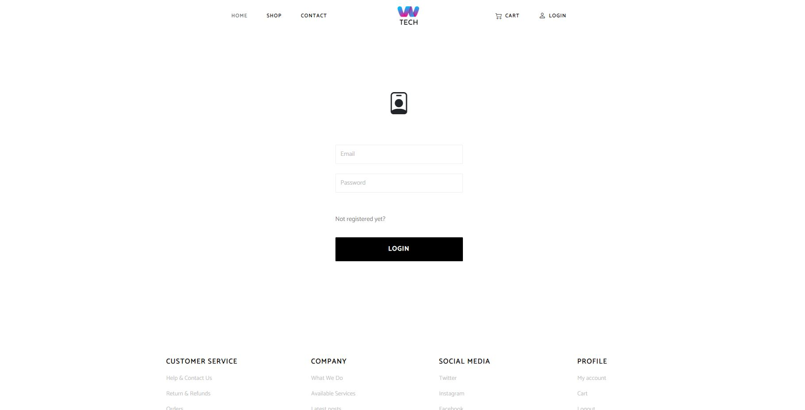
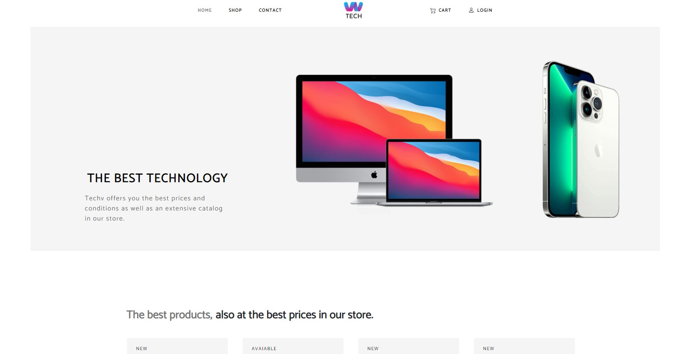
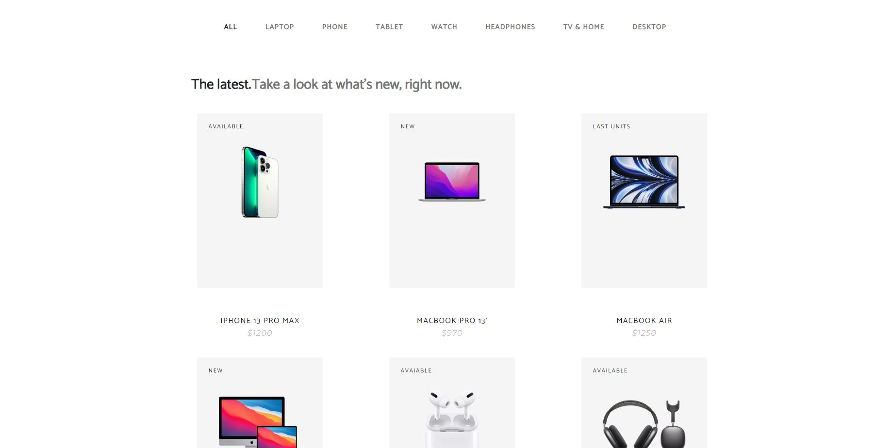
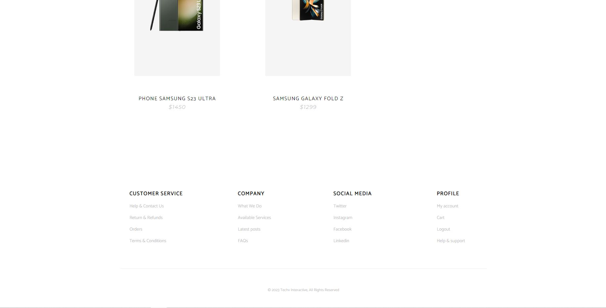
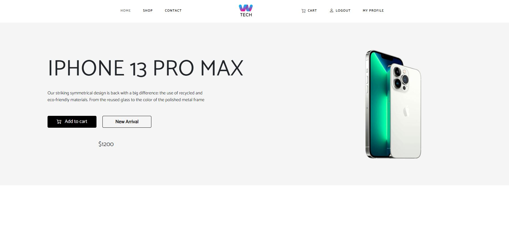
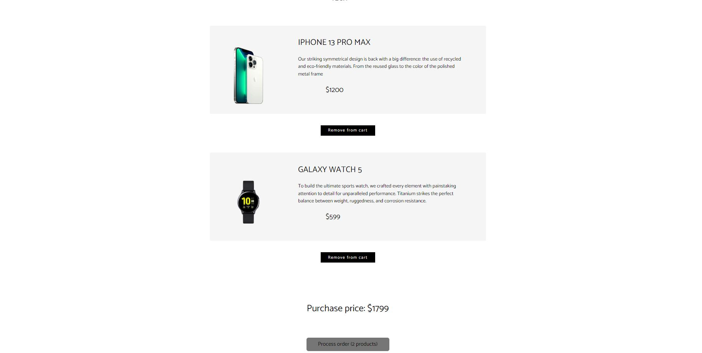
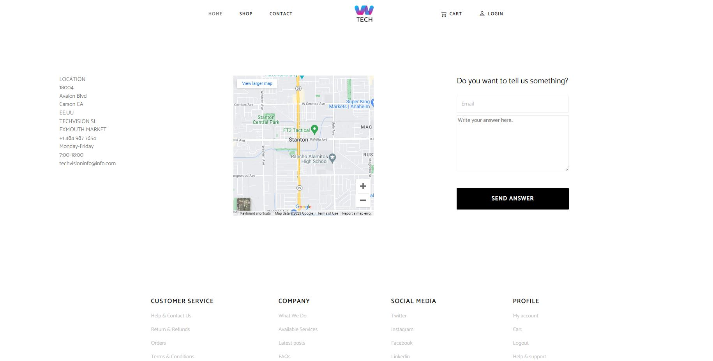
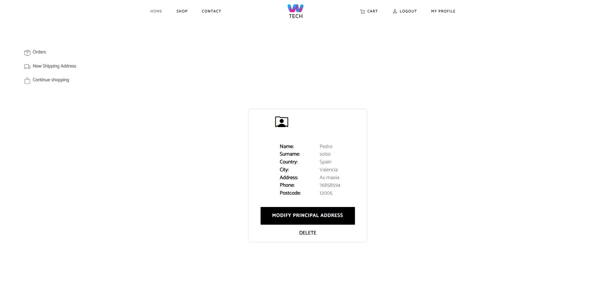
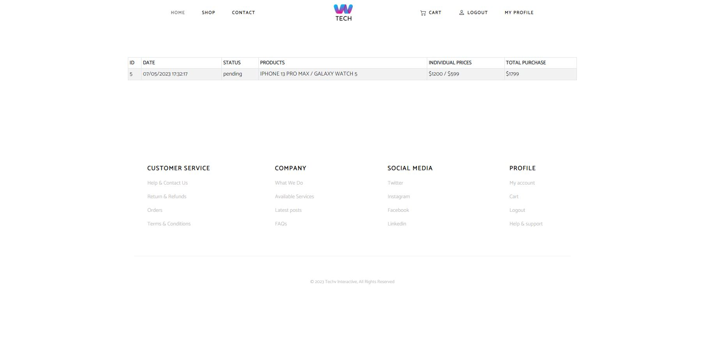
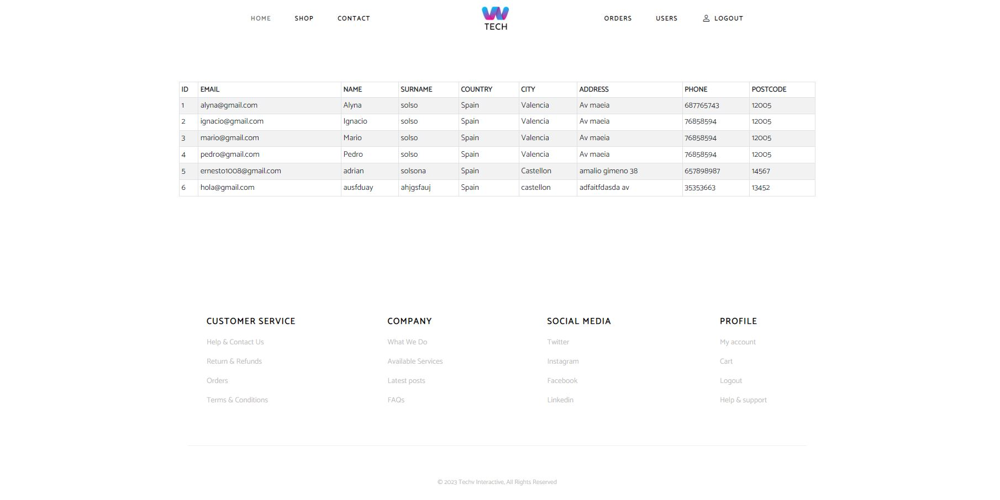

# Welcome to my frontend app React dental clinic 

<details>
  <summary>Content 📝</summary>
  <ol>
    <li><a href="#objetivo-🎯">Objective</a></li>
    <li><a href="#sobre-el-proyecto-🔎">About the project</a></li>
    <li><a href="#deploy-🚀">Deploy</a></li>
    <li><a href="#stack">Stack</a></li>
    <li><a href="#instalación-en-local">Installation</a></li>
    <li><a href="#vistas">Views</a></li>
    <li><a href="#futuras-funcionalidades">Future funcionalities</a></li>
    <li><a href="#contribuciones">Contributions</a></li>
    <li><a href="#licencia">License</a></li>
    <li><a href="#webgrafia">Webgrafy</a></li>
    <li><a href="#conclusion">Conclusion</a></li>
    <li><a href="#agradecimientos">Acknowledgments</a></li>
    <li><a href="#contacto">Contact</a></li>
  </ol>
</details>

## Objective 🎯
This project required connection to a functional API and using react to create a web site.

## About the project 🔎
  This project has been created as a final project of the bootcamp geekshubs academy where I created an ecommerce of technology products, which works similarly to any web purchase of technology products, where you can register and log in, view the products, make purchases through the cart, filter products by categories etc ..., also as admin there are different features such as viewing orders and users for example.
  
## Deploy 🚀
<div align="center">
    <a href="https://www.google.com"><strong>https://production.d19p3xpz9c7vfx.amplifyapp.com</strong></a>🚀🚀🚀
</div>

## Stack
<div align="center">
<a href="https://www.reactjs.com/">
    
</a>
<a href="https://developer.mozilla.org/es/docs/Web/JavaScript">
    
</a>
 </div>

## Local installation
1. Clone the repository
2. ` $ npm install `
3. ``` $ npm run dev ```
4. ...

## Views
|View of login|View of home| View of shop|
|-|-|-|
||| |
|Footer|Product detail|Cart|
|-|-|-|
||| |
|View of contact|Profile for user| Ordef of user|
|-|-|-|
||| |
|view users for admin|
|-|
||| |


## Functionalities
✅ view to create user

✅ view to login 

✅ view to create shipping address

✅ view to visualize the products both in store and at home

✅ search filter for products by categories

✅ shopping cart purchases

✅ visualization of the purchases made by the user

✅visualization of orders by the administrator

✅visualization of the registered users by the admin


## Future functionalities
⬜ search bar for products

⬜ visualization of the products in 3D

⬜ Add paginators in the views where products are displayed

## Contributions
Suggestions and contributions are always welcome.

You can do this in two ways:

1. Open an issue
2. Create a fork of the repository
    -  Create a new branch
        ```
        $ git checkout -b feature/nombreUsuario-mejora
        ```
    - Make a commit with your changes
        ```
        $ git commit -m 'feat: mejora X cosa'
        ```
    -  Push the branch
        ```
        $ git push origin feature/nombreUsuario-mejora
        ```
    - Open a Pull Request

## License
This project is under license from Mit License.

## Webgrafy:
Para conseguir mi objetivo he recopilado información de:
- https://www.npmjs.com/package/moment
- https://react-bootstrap.github.io/
- https://es.reactjs.org/

## Conclusion

We managed to raise and develop the proposed objective of creating a functional ecommerce of technological products. The main aspects of the project were addressed as all parts of the project were carried out using REACT, NODE, SEQUELIZE and JS technologies, the project was fully responsive, in addition to having all the features required in the Mvp to geekshubs academy.

I managed to identify the main problems of responsive design, the various problems that arose especially with the management of information and components in react, the difficulties with the consumption of the api of our personal backend project, and the modification of the database itself to access the necessary routes. Despite these difficulties we managed to adequately address all the functionalities foreseen in the base design of the project.

## Acknowledgments:

I thank my professors for their time dedicated to this project:

- *Dani*  
<a href="https://github.com/datata" target="_blank"></a> 

- **David**  
<a href="https://github.com/Dave86dev" target="_blank"></a>


## Contact

<a href ="solsona1008@gmail.com"></a>
<a href="https://www.linkedin.com/in/adriansolsona/" target="_blank"></a> 
</p>